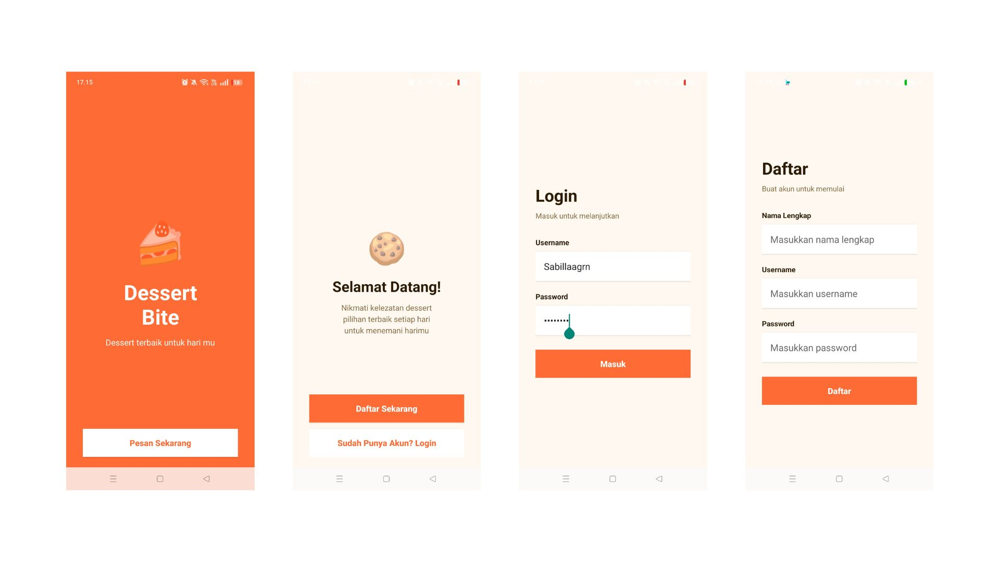
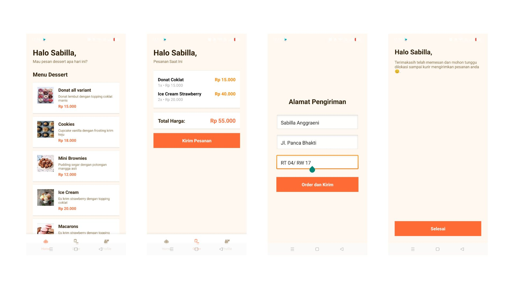

# 🍰 DessertBite

**DessertBite** adalah aplikasi Android sederhana yang dirancang untuk membantu pengguna memesan makanan, khususnya dessert atau makanan ringan. Aplikasi ini dibuat sebagai latihan pengembangan Android menggunakan **Kotlin** dan **XML Layout**, dengan tampilan yang sederhana dan interaktif.

---

## 🎯 Tujuan Proyek
Proyek ini dibuat untuk memenuhi tugas UTS pemrograman aplikasi Android, dengan tujuan agar mahasiswa memahami:
- Struktur dasar Activity dan Intent
- Navigasi antar halaman menggunakan Intent
- Desain antarmuka sederhana dengan XML
- Pengelolaan data input dari pengguna

---

## 🧩 Fitur Utama
- 🔑 **Login & Register** – Pengguna bisa masuk atau membuat akun 
- 🧁 **Halaman Utama** – Menampilkan menu makanan atau dessert yang bisa dipesan, Pengguna dapat memilih makanan yang ingin dipesan  
- 🛍️ **Order Detail** – berisi detail dan jumlah harga dari pesanan yg telah dipesan pengguna
- 🏠 **Pengiriman** – Form pengisian alamat dan data penerima untuk pengiriman orderan 
- ✅ **Halaman Terima Kasih** – Konfirmasi bahwa pesanan telah berhasil dilakukan. 

---

## 🧠 Teknologi yang Digunakan
- **Android Studio**
- **Kotlin**
- **XML Layout**
- **Intent (Explicit & Implicit)**
- **LinearLayout, EditText, Button, TextView**

---

## 📱 Tampilan Aplikasi (Wireframe)
Berikut contoh tampilan alur halaman pada aplikasi DessertBite:





## 🚀 Cara Menjalankan
1. Clone repository ini ke komputer kamu  
   ```bash
   git clone https://github.com/username/DessertBite.git
